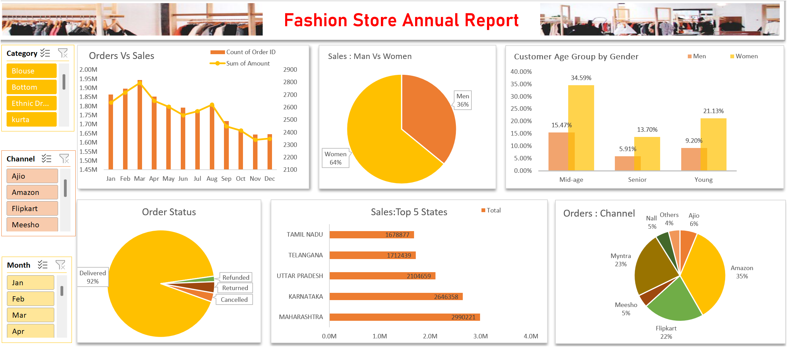

# Fashion-Store-Dashboard-project
A visually compelling Excel dashboard for a fashion store's annual performance report, showcasing key insights on sales, customer demographics, and order trends. Built to support data-driven business decisions and strategy planning.
# Fashion Store Annual Report Dashboard  

## Overview :  
This dashboard is created to analyze and present sales performance, customer demographics, and order trends for an online fashion store. The aim is to help stakeholders understand patterns across products, regions, and channels to make better business decisions and optimize operations.

## Tool used :  
&nbsp;

## Results and Insights :  
- **Amazon** is the leading channel with **35%** of total orders.
- **Women** represent **64%** of the total customer base, with strong engagement from the **mid-age** and **young** segments.
- The highest number of **orders and sales** were recorded in the **first quarter** of the year.
- **Delivered orders** account for a massive **92%**, indicating a strong operational efficiency.
- **Maharashtra** leads with the highest sales, followed by **Karnataka** and **Uttar Pradesh**.

## Additional Insights  
- Seasonal trend shows a sales peak during **March-April**, indicating a potential festive or seasonal demand.
- **Blouses and Ethnic Dresses** are among the most popular product categories.
- Channels like **Myntra** and **Flipkart** also hold a significant share, making it essential to maintain partnerships across platforms.
- Minimal cancellations and returns show customer satisfaction is relatively high.

## Data Story :  
This dashboard provides a comprehensive story of how our fashion store is performing across various dimensions. We observed that sales are concentrated in specific regions and seasons. By leveraging this insight, the business can:
- Launch **region-based campaigns** during peak sales months.
- Optimize **inventory and resource allocation** in top-performing states.
- Encourage more **personalized marketing** based on age and gender distribution.

## Dashboard :  

